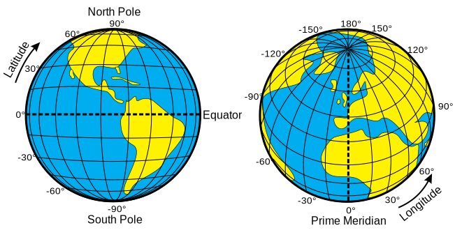

<h2 class="c-project-heading--task">Latitude and longitude</h2>
--- task ---
➡️ Store the current latitude and longitude of the ISS.
--- /task --- 

Latitude and longitude are used to give coordinates to locations on the Earth’s surface.

Create two variables and use them to store the **latitude** and **longitude** from the data you have just received. 

--- code ---
---
language: python
line_numbers: true
line_number_start: 10
---

latitude = data['latitude']
longitude = data['longitude']
print(latitude)
print(longitude)

--- /code ---

**Test:** Run your code and you should see the values of latitude and longitude printed.

### Tip
You can delete the line `print(data)` if you like.

